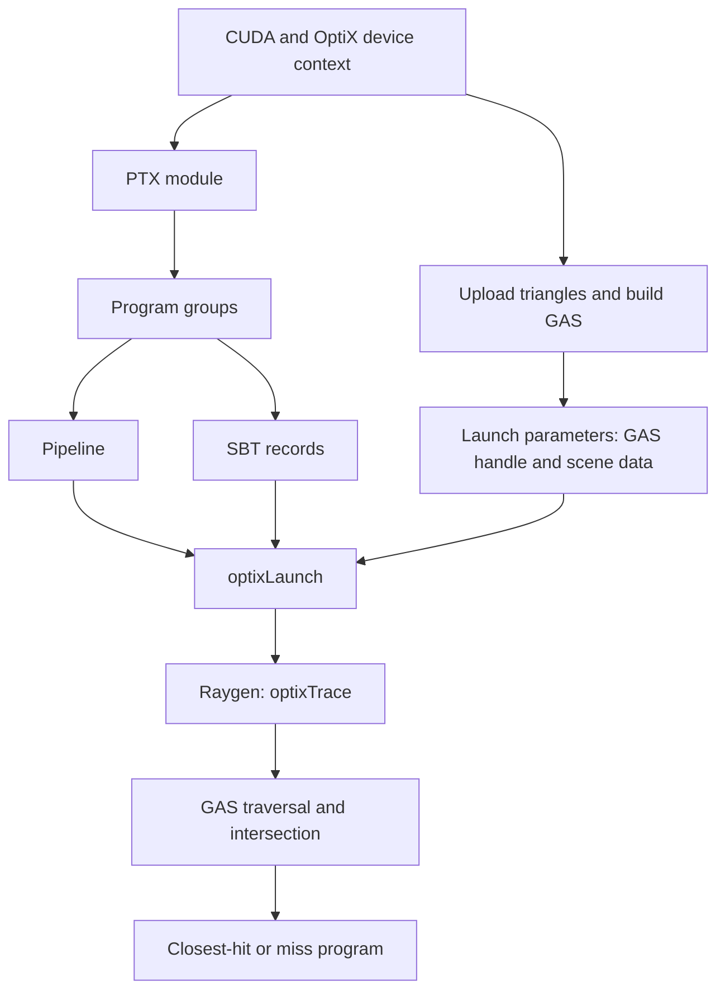
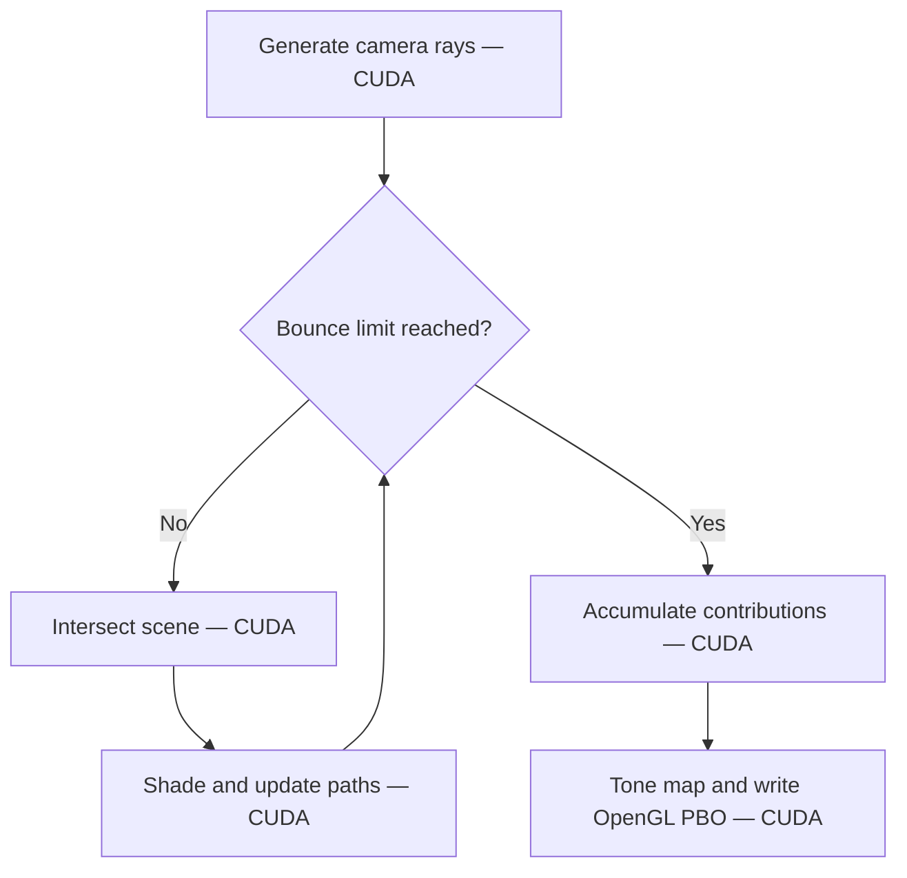
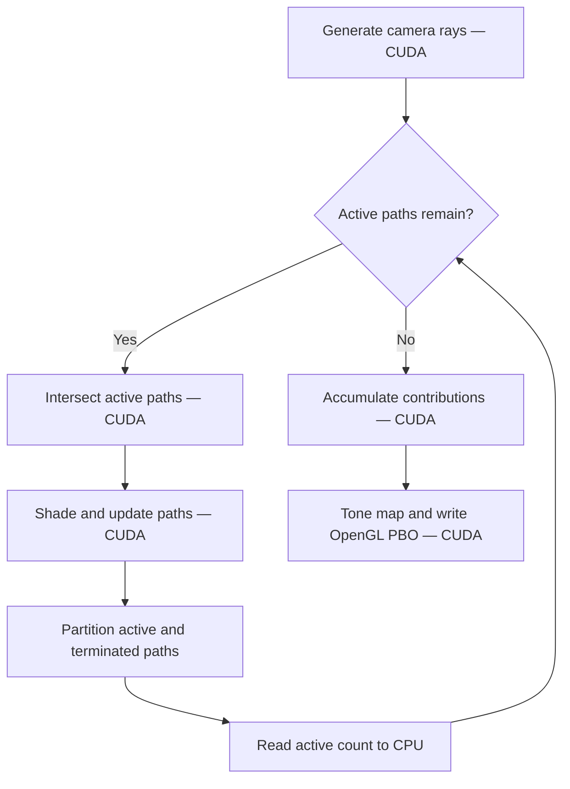
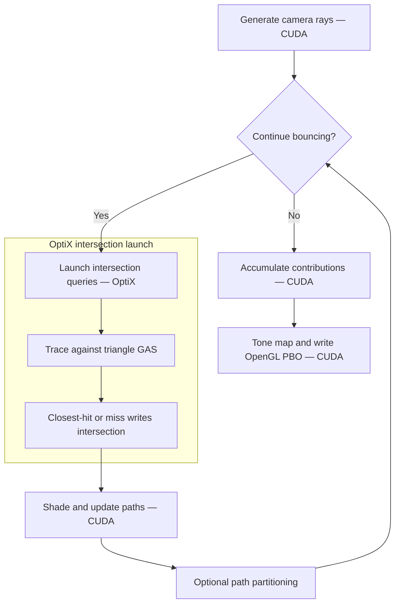
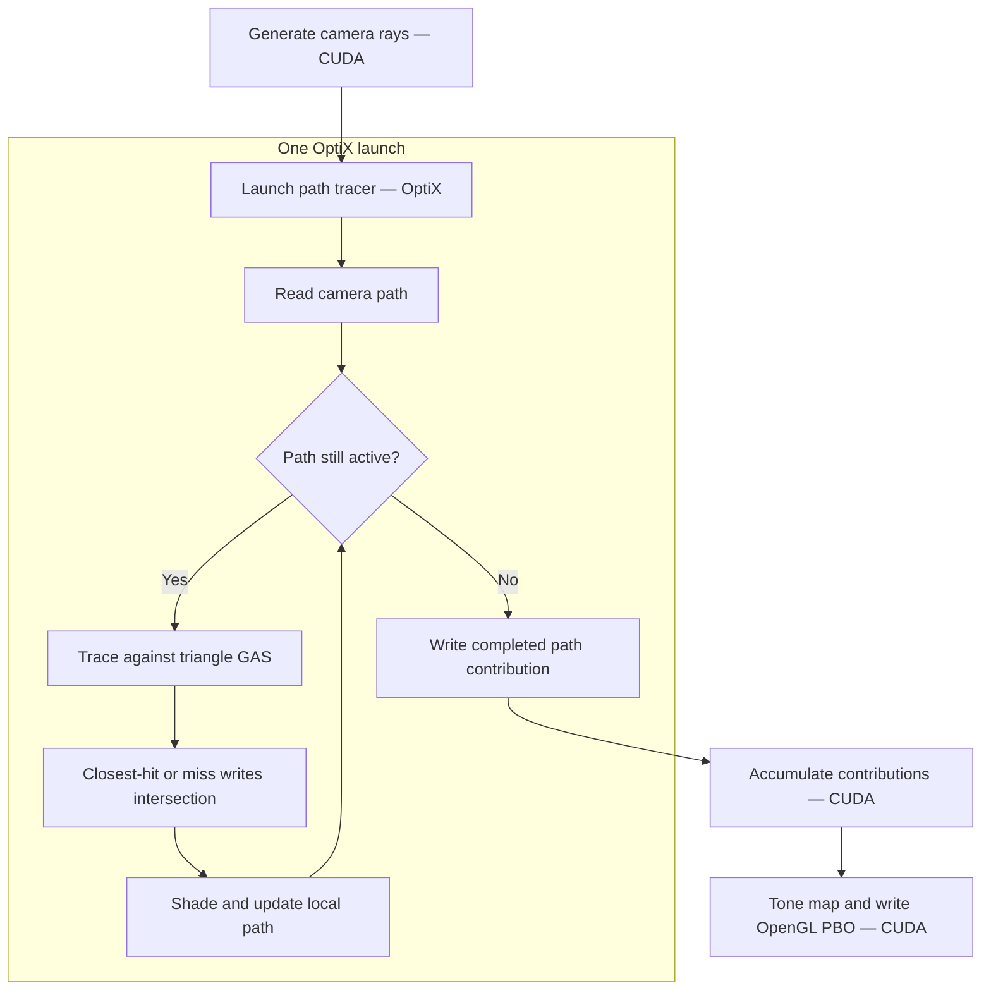

OptiX/CUDA Path Tracer
================

**University of Pennsylvania, CIS 565: GPU Programming and Architecture, Project 3**

* Luke (Hyuk Che) Kwon
  * [LinkedIn](https://www.linkedin.com/in/hyukchekwon/), [Personal Website](https://lukekwon98.github.io/)
* Tested on: Windows 11, AMD Ryzen 5 5600X 6-Core Processor @ ~3.7GHz 16GB, Nvidia GeForce RTX 3060 (Compute Capability 8.6)

## Overview

This project is a GPU path tracer built with CUDA and NVIDIA OptiX, supporting glTF meshes, physically based materials, texture and normal mapping, HDR environment lighting with multiple importance sampling, and depth of field.

The project explores how rendering architecture affects performance, starting with separate CUDA kernels for camera generation, intersection, and shading, then introducing OptiX intersections, moving the bounce loop into raygen, and finally generating camera rays within the same program. The earlier execution paths remain available for comparison.


### Render Gallery

| Render 1 | Render 2 |
| :---: | :---: |
|  |  |

| Render 3 | Render 4 |
| :---: | :---: |
|  |  |

| Render 5 | Render 6 |
| :---: | :---: |
|  |  |

| Render 7 | Render 8 |
| :---: | :---: |
|  |  |

## OptiX Integration

The renderer uses OptiX to build a geometry acceleration structure (GAS) over the scene’s triangles and trace rays against it. The integration consists of the following components:

| Component | Role in this renderer |
|---|---|
| Device context | Associates OptiX with the CUDA context used by the renderer. |
| PTX module | Loads the GPU programs compiled from `optixPrograms.cu`. |
| Program groups | Select the raygen, closest-hit, and miss entry points. |
| Pipeline | Links those program groups and configures their stack requirements. |
| Shader binding table (SBT) | Identifies the programs used for ray generation, hits, and misses. |
| Geometry acceleration structure (GAS) | Accelerates intersection queries over the uploaded triangle mesh. |
| Launch parameters | Provide GPU programs with the scene buffers, camera, materials, textures, and rendering settings. |

### Setup Sequence

OptiX setup happens once during initialization. The resulting pipeline, shader binding table, and scene data are then reused for rendering.

1. **Create the device context.** Initialize CUDA and OptiX, then create an OptiX device context associated with the renderer’s CUDA context.

2. **Load the PTX and create a module.** CMake compiles `optixPrograms.cu` into PTX during the build. At runtime, OptiX loads that PTX into a module containing the raygen, closest-hit, and miss programs.

3. **Create program groups.** Each program group references the module and selects the entry point for its role: ray generation, closest hit, or miss.

4. **Create the pipeline.** Link the program groups into a pipeline and configure the stack sizes required to execute them.

5. **Build the shader binding table (SBT).** Pack headers from the program groups into SBT records and upload them to GPU memory. The SBT tells a launch which raygen, miss, and hit-group records to use.

6. **Upload geometry and build the GAS.** Upload the triangle mesh and build its acceleration structure. OptiX returns a traversable handle that identifies the GAS for subsequent ray queries. This geometry setup is independent of module and pipeline creation.

7. **Populate launch parameters.** Store the GAS handle, GPU buffer pointers, camera data, and rendering settings in the launch-parameter structure, then upload it to the GPU.

8. **Launch rendering.** Call `optixLaunch` with the pipeline, SBT, launch parameters, CUDA stream, and launch dimensions. The raygen program calls `optixTrace` with the GAS handle. Traversal then invokes the appropriate closest-hit or miss program.



The pipeline supplies the executable programs, the SBT selects their records, and the launch parameters supply the data those programs operate on.

### Geometry and intersection data

The glTF loader applies scene-node transforms to mesh data before uploading it. Meshes are combined into a single triangle GAS, with per-triangle material IDs linking geometry to shading data.

The closest-hit program uses triangle barycentric coordinates to interpolate vertex normals, texture coordinates, and tangents. It also computes the geometric normal, which is retained separately for refraction and ray-origin offsets. The miss program records that no surface was found.

### Two OptiX execution paths

The first path uses OptiX only for intersection queries. The CPU controls the bounce loop, and a separate CUDA kernel shades each batch of intersections.

The second path moves the bounce loop and shading into `__raygen__pathtrace`. Each invocation maintains a path locally, repeatedly traces and shades it until termination, and writes its completed contribution for the CUDA `finalGather` kernel. Camera-ray generation can also run inside this raygen program, removing the separate camera-generation kernel.

Both paths share the same closest-hit and miss programs. Image accumulation and conversion to the OpenGL pixel buffer remain CUDA operations.

## Rendering Architecture and Performance

### CUDA Baseline

The CUDA baseline uses a CPU-controlled bounce loop with separate GPU kernels for camera-ray generation, intersection testing, and shading. Each iteration generates one jittered camera ray per pixel and accumulates its contribution into the image.

The intersection kernel tests each active ray against every sphere and box in the JSON scene. The shading kernel updates the path’s throughput and direction, or terminates it when it misses, reaches an emitter, or exhausts its bounce budget.



Without stream compaction, each bounce launches kernels over the full path buffer. Terminated paths return early, but their slots remain part of subsequent launches.

### Stream Compaction

Stream compaction groups surviving paths at the front of the path buffer after shading. The next bounce can then launch work over only the surviving paths.



Partitioning preserves terminated paths and their completed contributions. Each path retains its original pixel index, allowing `finalGather` to accumulate the result into the correct pixel after reordering.

The implementation supports four configurations:

| `USE_PARTITION` | Configuration | Subsequent launches |
|---|---|---|
| `0` | No partitioning | Full path count. Terminated paths return early. |
| `1` | Thrust partition | Active path count returned by `thrust::partition`. |
| `2` | CUB partition with reusable temporary storage | Active path count copied back to the CPU. |

The flowchart above describes modes `1` and `2`. Mode `3` retains a fixed number of bounce iterations and full-size launches, avoiding the active-count readback while still grouping active paths.

Compaction introduces partitioning overhead, and modes `1` and `2` also require the CPU to obtain the active count before scheduling the next bounce. Its benefit therefore depends on how quickly paths terminate and how much intersection and shading work remains.

### Stream Compaction Evaluation

The comparison uses identical camera settings, materials, resolution, and maximum bounce depth within each test scene.

- **Open scene:** Measure how quickly escaping paths reduce the active workload.
- **Closed scene:** Measure the benefit when more paths survive until reaching an emitter or the bounce limit.
- **Surviving paths:** Plot the active path count after each bounce.
- **Execution time:** Compare intersection, shading, partitioning, and total iteration time using Nsight Systems.

#### CUDA Profiling: Brute Force, BVH, and Compaction

| Configuration | Capture |
|---|---|
| CUDA brute force |  |
| CUDA brute force + CUB |  |
| CUDA BVH |  |
| CUDA BVH + CUB |  |

The brute-force capture is dominated by long `computeTriangleIntersections` kernels. Its selected-frame average is **65.87 ms (15.18 FPS)**. Adding CUB reduces this to **51.36 ms (19.47 FPS)**, about **22% less frame time**. Intersection work still dominates, but reducing the active workload is valuable while every surviving ray must test the mesh's triangles.

Introducing a CUDA BVH changes the scale of the workload. The no-compaction capture averages **4.35 ms (229.72 FPS)**, approximately **15.1× faster** than the brute-force capture. The timeline now exposes the repeated intersection/shading sequence instead of being dominated by one very long intersection kernel.

Adding CUB to the BVH version averages **5.48 ms (182.33 FPS)** in the selected frames, about **26% more frame time** than BVH alone. The GPU timeline contains additional work, memory operations, and gaps, while the CPU API row repeatedly enters `cudaMemcpy`. Once intersection is much cheaper, partitioning and the dependencies between bounces can outweigh the work saved by removing terminated paths. The controlled Suzanne benchmark shows the same direction, although a smaller difference: **226 FPS without CUB versus 210 FPS with CUB**.

Long CPU API calls can include waiting for earlier GPU work. For example, `cudaGLMapBufferObject` spans much of the brute-force frame while intersection kernels run, and long `cudaMemcpy` calls overlap GPU execution in the CUB capture. Their CPU durations should not be interpreted as isolated transfer costs. The kernel/memory percentages shown on the CUDA track are also not SM occupancy or memory-bandwidth measurements.


### OptiX Intersection Queries

This version preserves the CPU-controlled bounce loop but replaces the CUDA intersection kernel with an OptiX launch. Each raygen invocation reads an existing path and calls `optixTrace`. The closest-hit or miss program writes an intersection result, which the separate CUDA shading kernel then consumes.



With active-count compaction enabled, the loop continues while active paths remain. Without it, the loop runs to the configured bounce limit, and terminated paths return early.

This architecture introduces accelerated triangle intersection while preserving the original separation between tracing and shading. However, every bounce still requires an OptiX launch, a CUDA shading launch, and optional partitioning. Intersection results and updated path state pass between stages through GPU buffers.

#### OptiX Profiling: No Compaction, Thrust, and CUB

| Configuration | Capture |
|---|---|
| OptiX intersections — no compaction |  |
| OptiX intersections + Thrust |  |
| OptiX intersections + CUB |  |

Without compaction, the capture shows repeated pairs of OptiX intersection launches and CUDA shading kernels. Later pairs are shorter, but each bounce still requires host scheduling and separate stages. Small memory events and repeated CPU `cudaMemcpy` calls are visible even in the no-compaction capture, so not every transfer in an OptiX timeline can be attributed to path compaction.

The Thrust capture shows substantial time in kernels whose names begin with thrust, followed by further Thrust work. Long `cudaStreamSynchronize` calls and a visible `cudaFree` accompany this sequence. This is evidence that the selected compaction implementation introduces substantial processing and synchronization around an otherwise short intersection/shading stage. The screenshot alone does not identify the purpose of every internal Thrust kernel. The benchmark results establish the overall penalty: for Suzanne, **320 FPS without compaction drops to 132 FPS with Thrust**. Thrust is slower in all four reported scenes.

The CUB capture shows a prominent initial partition stage followed by much smaller later-bounce tasks and memory events. This is consistent with the benefit of processing fewer surviving paths, although the screenshot does not report their counts. In the controlled results, CUB raises Suzanne from **320 to 342 FPS** and FlightHelmet from **295 to 300 FPS**, but lowers Sponza from **99 to 77 FPS**. CUB substantially improves on this Thrust implementation, but compaction is still a scene-dependent tradeoff.

#### Extra: Fixed-Count CUB Compaction

The fixed-count CUB mode retains full-size launches and a fixed number of bounce iterations, avoiding the active-count readback while still grouping active paths.

| Implementation | Box | Suzanne | FlightHelmet | Sponza |
|---|---:|---:|---:|---:|
| OptiX ISect | 350 | 320 | 295 | 99 |
| OptiX ISect + CUB | 390 | 342 | 300 | 77 |
| OptiX ISect + Fixed CUB | 156 | 150 | 147 | 78 |

*FPS*

Fixed-count CUB is slower than no compaction in every tested scene. Although it avoids reading the active count back to the CPU, it still pays for partitioning and launches subsequent kernels over the full path count. Grouping surviving paths alone does not recover these costs in these tests.

Compared with active-count CUB, fixed-count CUB performs substantially worse for Box, Suzanne, and FlightHelmet. Sponza is nearly unchanged at 78 versus 77 FPS.

#### Enclosed Scene

| Open | Enclosed |
|---|---|
|  |  |

| Configuration | Suzanne Open | Suzanne Enclosed |
|---|:---:|:---:|
| **OptiX ISect** |  |  |
| **OptiX ISect + CUB** |  |  |

In the enclosed no-compaction capture, substantial intersection and shading work remains across the bounce sequence. With CUB, substantial work also persists, with partition stages and memory operations repeated between bounces. Unlike the rapidly shrinking tail in the other CUB capture, this sequence suggests that more paths continue bouncing inside the enclosure.

The selected-frame average increases from **8.37 ms (119.52 FPS)** without compaction to **12.11 ms (82.56 FPS)** with CUB: about **45% more frame time**, or **31% lower FPS**. This supports the expected limitation of compaction in a closed scene: paying to partition paths is less useful when many paths survive. Actual per-bounce active counts would be needed to quantify that explanation.

| Implementation | Suzanne Open | Suzanne Enclosed |
|---|---:|---:|
| OptiX ISect | 320 | 128 |
| OptiX ISect + CUB | 342 | 91 |

CUB improves throughput by **6.9%** in the open scene but reduces it by **28.9%** in the enclosed scene. Escaping paths in the open scene allow compaction to reduce subsequent work. In the enclosure, more paths continue bouncing, leaving less work to eliminate while partitioning and active-count readback still incur overhead. This agrees with the profiling captures above.


### Moving the Bounce Loop into OptiX Raygen

The next version moves the entire per-path bounce loop into `__raygen__pathtrace`. Each invocation reads a camera path, traces it, evaluates its material, and repeats until the path terminates.



The CPU no longer schedules individual bounces. Path state is maintained locally within each invocation, and the completed contribution is written to the output buffer after termination. Intersection results still use the shared intersection buffer.

This removes the separate shading launches and per-bounce partitioning passes. It also changes how work is distributed: invocations can execute different numbers of bounces and take different material branches. The performance comparison examines the balance between reduced launch and buffer traffic overhead and this variation in execution.

#### If we pass more code into "OptiX kernels", where is that code actually run? Can RT cores handle non-RT supported code?

According to [NVIDIA documentation](https://forums.developer.nvidia.com/t/take-full-advantage-of-cuda-core-and-rt-core/241682), application-defined OptiX programs execute on the GPU’s SMs, while RT cores accelerate acceleration-structure traversal and ray–triangle intersection. Camera-ray generation, random sampling, BSDF evaluation, and path-throughput updates therefore continue to execute on ordinary programmable SM hardware when moved into raygen. Closest-hit and miss programs also execute on SMs. CUDA kernels and OptiX programs also access the same CUDA-allocated GPU buffers through device pointers. 

The Nsight Systems captures show the resulting change in execution structure. Repeated OptiX intersection launches and CUDA shading kernels become one main OptiX interval, followed by CUDA accumulation and display conversion. When camera generation also moves into raygen, its separate CUDA kernel disappears. These traces support the reduction in separately launched stages. They do not expose the division of work between SMs and RT cores within the OptiX interval.

#### Profiling the Raygen Bounce Loop

| Configuration | Capture |
|---|---|
| OptiX bounce loop |  |

The repeated intersection/shading launch pairs are replaced by one main OptiX GPU interval. A separate `generateRayFromCamera` kernel still precedes it, and `finalGather` and display conversion follow it. The capture therefore directly shows the reduction in separately scheduled stages. It reports **1.73 ms (577.38 FPS)** over the selected frames.

The controlled Suzanne benchmark increases from **320 FPS** with OptiX intersection queries alone to **680 FPS** with the bounce loop in raygen, a **2.13× speedup**. This is consistent with avoiding per-bounce host scheduling and separate shading launches. The timeline does not independently measure the contribution of reduced buffer traffic, register use, or divergence, and shading still executes on GPU SMs.


### Generating Camera Rays Inside Raygen

The final architecture also generates camera rays inside `__raygen__pathtrace`. Each invocation derives its pixel coordinates from its launch index, generates a jittered camera ray, optionally applies thin-lens depth of field, and enters the bounce loop.

This replaces the separate camera-generation kernel and the initial read from the path buffer. The rest of the raygen-loop architecture remains unchanged: completed contributions are written once, then accumulated and converted for display by CUDA kernels.

The `USE_RAYGEN_CAMERA` toggle preserves the separate-camera version for comparison.

#### Profiling Camera Generation Inside Raygen

| Configuration | Capture |
|---|---|
| OptiX bounce loop + camera |  |
| OptiX bounce loop + camera — no forced inline |  |

With camera generation included, the separate camera kernel disappears. The visible main GPU sequence becomes **OptiX path tracing → final gather → display conversion**. The selected-frame average is **1.13 ms (884.20 FPS)**, compared with **1.73 ms** in the separate-camera capture. The controlled Suzanne benchmark similarly improves from **680 to 960 FPS**, a **41% increase**.

Gaps remain around the short GPU sequence. Once tracing is this fast, host execution, presentation, and scheduling are plausible contributors to total frame time, but these screenshots do not isolate their individual costs.

#### Extra: Forced Inlining

| Implementation | Box | Suzanne | FlightHelmet | Sponza |
|---|---:|---:|---:|---:|
| OptiX Loop + Cam | 1070 | 960 | 723 | 172 |
| OptiX Loop + Cam — No Forced Inline | 1050 | 960 | 720 | 170 |

*FPS*

Removing forced inlining has little effect on measured throughput: FPS decreases by **1.9% for Box**, remains unchanged for **Suzanne**, and decreases by **0.4% for FlightHelmet** and **1.2% for Sponza**. Without repeated measurements and variability estimates, these small differences do not establish a consistent performance benefit.

Both profiling captures retain the same main GPU sequence: OptiX path tracing, final gather, and display conversion. Removing `__forceinline__` allows the compiler to make its own inlining decisions, as it does not guarantee that these functions remain uninlined.

### Shared Benchmark Configuration

Within each scene, all implementations use identical triangle geometry, image resolution,
emissive-light geometry and intensity, and maximum bounce depth.

Surfaces use Lambertian diffuse shading with cosine-weighted hemisphere
sampling. Textures, normal mapping, metallic–roughness shading, refraction, depth of
field, environment lighting, and explicit direct-light sampling/MIS are
disabled for these architecture comparisons.

Camera framing may differ between benchmark scenes, but remains fixed
across implementations within each scene. The enclosed Suzanne scene uses
a fully closed diffuse box surrounding both Suzanne and the emitter.

| Setting | Value |
|---|---|
| GPU | NVIDIA GeForce RTX 3060 |
| Build configuration | Release |
| Resolution | 800 x 800 |
| Maximum bounce depth | 8 |
| Samples / measurement interval | 10s, after 5 seconds of warmup |

### Performance Results

Average FPS under the shared benchmark configuration above. Column headings list mesh triangle counts.

**CUDA BVH comparison:** I did not write the CUDA BVH and Möller-Trumbore intersection implementations. They were generated using Chat GPT under the permission of professor Schwartz, and used only as a performance baseline for comparison with my OptiX implementation. Therefore they were not included in my commits, and are not listed as supported features of this project.


| **Implementation** | **Box: 12** | **Suzanne: 3,936** | **FlightHelmet: 94,722** | **Sponza: 262,267** |
| :---: | ---: | ---: | ---: | ---: |
| **CUDA Brute** | 420 | 15 | 0.7 | 0 |
| **CUDA Brute + CUB** | 460 | 19 | 0.8 | 0.1 |
| **CUDA BVH** | 410 | 226 | 110 | 11 |
| **CUDA BVH + CUB** | 460 | 210 | 124 | 11 |
| **OptiX ISect** | 350 | 320 | 295 | 99 |
| **OptiX ISect + Thrust** | 175 | 132 | 125 | 31 |
| **OptiX ISect + CUB** | 390 | 342 | 300 | 77 |
| **OptiX Loop** | 755 | 680 | 576 | 162 |
| **OptiX Loop + Cam** | 1070 | 960 | 723 | 172 |

| Box — 12 triangles | Suzanne — 3,936 triangles |
| :---: | :---: |
|  |  |

| FlightHelmet — 94,722 triangles | Sponza — 262,267 triangles |
| :---: | :---: |
|  |  |

The fastest measured configuration is **OptiX Loop + Cam** in all four scenes. Relative to CUDA BVH without compaction, it is **2.61× faster for Box**, **4.25× for Suzanne**, **6.57× for FlightHelmet**, and **15.64× for Sponza**. These ratios use the controlled FPS table, rather than selected profiler frames. The profiling captures above explain the architectural progression: accelerate intersection first, then reduce the repeated scheduling and staging work around it.

## Visual Features

The full feature set is implemented in the OptiX raygen path. The host-controlled rendering paths remain available for architecture comparisons.

### Stochastic Antialiasing

Each iteration samples a random position within every pixel and generates a camera ray through that position. Accumulating these samples progressively smooths silhouette edges and other subpixel details.

Random seeds depend on the iteration and pixel index, with a fixed depth seed of zero for primary camera rays. Both the CUDA camera kernel and the OptiX camera implementation use this approach.

| Without jitter - Mesh | With jitter - Mesh |
| :---: | :---: |
|  |  |

| Without jitter - Implicit geometry | With jitter — Implicit geometry |
| :---: | :---: |
|  |  |

### Reflection, Refraction, and Fresnel

The renderer supports smooth dielectric transmission and reflection. At each glass intersection, the geometric normal determines whether the ray is entering or leaving the surface, selecting the corresponding incident and transmitted indices of refraction.

The full dielectric Fresnel equations determine the probability of reflection. Otherwise, the ray refracts according to Snell’s law. Total internal reflection produces a reflected ray, and transmitted paths include the squared relative-index-of-refraction factor for radiance transport.

The outgoing ray origin is offset to the appropriate side of the geometric surface to reduce self-intersection artifacts.

A separate reflective material supports perfect mirror reflection at zero roughness and microfacet reflection at nonzero roughness.

| Reflection | Reflection 2 | Reflection 2 |
| :---: | :---: | :---: |
|  |  |  |

| Refraction | Refraction 1 |
| :---: | :---: |
|  |  |

### Microfacet and Metallic–Roughness Materials

#### Metallic–Roughness Grids

The top left is **metallic = 1, roughness = 0**, and the bottom right is **metallic = 0, roughness = 1**.

| White | Gold | Blue |
| :---: | :---: | :---: |
|  |  |  |

#### Roughness Tests

| Roughness: 0 | Roughness: 0 |
| :---: | :---: |
|  |  |

| Roughness: 0.2 | Roughness: 0.2 |
| :---: | :---: |
|  |  |

| Roughness: 0.5 | Roughness:0.5 |
| :---: | :---: |
|  |  |

| Roughness: 1 | Roughness: 1 |
| :---: | :---: |
|  |  |

Rough reflective surfaces use the GGX / Trowbridge–Reitz microfacet distribution, a masking-shadowing term, and a Fresnel term. Sampled directions update path throughput using the BSDF value, surface cosine, and sampling probability density.

The metallic–roughness material combines diffuse and specular reflection:

- At metallic zero, the material has a colored diffuse component and a neutral specular component.
- At metallic one, the diffuse component disappears and the base color controls specular reflection.
- Intermediate values blend these behaviors.

Sampling chooses between diffuse and specular directions. The throughput calculation uses the combined mixture PDF, accounting for both ways of generating a direction.

For glTF materials, perceptual roughness is converted to the microfacet parameter using alpha = (roughnessFactor * roughnessTexture)^2.

### glTF Mesh Loading

The renderer loads indexed triangle meshes from `.gltf` files using TinyGLTF. Scene traversal combines parent and child transforms, applying the resulting world transform to each mesh instance.

The loader reads vertex positions, normals, texture coordinates, tangents, and material properties. It handles accessor offsets and strides, validates buffer bounds, and supports unsigned 8-bit, 16-bit, and 32-bit triangle indices.

Loaded mesh data is uploaded to GPU buffers and combined into a single OptiX geometry acceleration structure. Per-triangle material IDs connect each intersection to its material.

The closest-hit program interpolates surface attributes using triangle barycentric coordinates. When vertex normals are unavailable, it uses the geometric triangle normal.

The benchmark mesh renders are shown in the performance results above.

### Texture, Metal Roughness, Normal Mapping

| Base Color | Metallic–Roughness | Normal |
| :---: | :---: | :---: |
|  |  |  |

Material images are decoded into unsigned 8-bit RGBA data and uploaded to CUDA arrays. CUDA texture objects provide linear filtering and the configured wrapping behavior. Base-color textures receive sRGB decoding, while metallic–roughness and normal maps are sampled as linear numerical data. All three use interpolated `TEXCOORD_0` coordinates. Texture transforms and additional UV sets are outside the current implementation’s scope.

**Base-color mapping** multiplies the sampled texture color by the material’s base-color factor, allowing surface color to vary across a mesh.

**Metallic–roughness mapping** reads roughness from the texture’s green channel and metallic from its blue channel. These values multiply the corresponding material factors. The combined roughness is squared to obtain the GGX microfacet parameter, while metallic remains linear. This creates spatially varying surface finishes without adding geometry.

**Normal mapping** perturbs the shading normal using a tangent-space direction decoded from the texture. The decoded X and Y components are scaled by the material’s normal-map strength before normalization.

The tangent frame uses interpolated glTF tangents when available. Otherwise, it is derived from triangle edges and UV differences. The tangent is orthogonalized against the interpolated normal, and its handedness determines the bitangent orientation. The mapped normal is accepted only when it faces both the appropriate geometric hemisphere and the viewing direction. Degenerate tangent frames retain the original shading normal. Normal mapping applies to metallic–roughness materials, while glass continues to use the geometric normal.

Together, these maps independently control surface color, material response, and shading detail:


*All three maps applied together.*

### HDR Environment Lighting and Multiple Importance Sampling

| Environment MIS Disabled | Environment MIS Enabled |
| :---: | :---: |
|  |  |

An rectangular HDR image supplies incoming radiance from the surrounding environment. Ray directions are converted to texture coordinates, allowing the environment to appear as the background and illuminate surfaces through material interactions. The image is loaded as floating-point data to preserve high radiance values, while lighting calculations and progressive accumulation remain in linear space.

With BSDF sampling alone, paths gather environment illumination when their sampled directions escape the scene. Small, bright regions of the environment can be difficult to sample consistently, producing high variance.

To sample the environment directly, the loader builds a cumulative distribution over its pixels. Each pixel is weighted by its luminance and spherical solid angle, with a small luminance floor to preserve sampling support in dark regions. The GPU selects a pixel using binary search, then samples a direction uniformly within that pixel’s solid angle.

For metallic–roughness materials, **multiple importance sampling (MIS)** combines two strategies:

- **Environment sampling:** Sample a direction from the environment distribution and trace a visibility ray.
- **BSDF sampling:** Sample a direction from the material distribution and evaluate the environment if the path escapes.

Both PDFs are expressed per unit solid angle. Their contributions are weighted using the power heuristic p_a^2/(p_a^2 + p_b^2}.

The renderer stores the previous BSDF PDF so that an escaping BSDF-sampled ray receives the complementary MIS weight. Direct-light contributions are accumulated separately from path throughput.

`USE_ENVIRONMENT_MIS` toggles direct environment sampling and MIS. Enabling it adds distribution-sampling work and visibility rays per eligible surface hit, trading additional work per iteration for the potential to reduce variance. When disabled, environment illumination is gathered through BSDF-sampled paths alone.

### Depth of Field

| No DOF | DOF |
| :---: | :---: |
|  |  |

The OptiX camera implements a thin-lens model. A jittered pinhole ray first determines a point on the focal plane. The ray origin is then sampled uniformly over a circular aperture, and its direction is adjusted toward that focal point.

The camera exposes two JSON parameters:

| Parameter | Effect |
|---|---|
| `APERTURE_RADIUS` | Controls the aperture size. Zero produces a pinhole camera. |
| `FOCAL_DISTANCE` | Sets the focal plane’s distance along the camera’s forward direction. |

Depth of field is available when camera rays are generated inside OptiX raygen.

### Tone Mapping and Gamma Correction

RGB values in scenes are usually in a much larger range than 0 - 255, in order to account for the different intensity of light, so  we apply Reinhard tone mapping in order to map this back into the 8 bit rgb range, .


In addition, to account for the fact that humans are more sensitive to color changes in the dark, we must apply gamma correction to tailor the linear rgb values to human perception.

The result is converted to 8-bit color and written directly to the OpenGL pixel buffer. Tone mapping affects the displayed image while the accumulation buffer retains linear radiance.

| Without Reinhard and gamma correction | With Reinhard and gamma correction |
| :---: | :---: |
|  |  |

Without the display conversion, the overall scene appears very dark, while the brightest reflections become nearly solid white. With Reinhard tone mapping and gamma correction, shadow and midtone detail is more visible and the bright reflections retain more visible variation. Reinhard compresses high radiance values, while gamma correction changes their display encoding. This pair demonstrates their combined effect rather than isolating either operation.

## Build and Usage

### Installing the OptiX SDK

Download the NVIDIA OptiX SDK from the [official OptiX page](https://developer.nvidia.com/designworks/optix/download). This project was developed with OptiX SDK 9.1.0.

After installing or extracting the SDK, set OPTIX_ROOT in CMakeLists.txt to its installation directory. For example:

```cmake
set(OPTIX_ROOT "C:/ProgramData/NVIDIA Corporation/OptiX SDK 9.1.0")
```

The selected directory should contain include/optix.h. Reconfigure CMake after changing the path.

The CUDA Toolkit must also be installed separately. It is used to compile the renderer and generate the PTX loaded by OptiX.


### Build Configuration

The project uses CMake with C++17 and CUDA17. The current configuration targets an RTX 3060 and references OptiX SDK 9.1.0.

Before configuring the project, update OPTIX_ROOT in CMakeLists.txt to your local OptiX SDK installation.

Build in Release mode for performance measurements. The current CMake configuration enables CUDA device debugging (`-G`) for both Debug and RelWithDebInfo.

### CMake Integration

`CMakeLists.txt` was modified beyond adding source files to integrate OptiX:

- Added the TinyGLTF and OptiX include directories.
- Added a separate `optixPrograms` target that compiles `optixPrograms.cu` to PTX.
- Configured the PTX target for compute capability 8.6 using `86-virtual`.
- Disabled separable compilation for the PTX target.
- Made the renderer depend on the PTX target.
- Defined `OPTIX_PTX_PATH` so the renderer can locate the generated PTX file.

The main executable uses native CUDA architecture selection, while the OptiX PTX target explicitly uses compute capability 8.6.

### Scene Selection

The executable accepts a JSON scene file:

```bash
cis565_path_tracer scenes/cornell.json
```

In Visual Studio, set the scene path under **Debugging > Command Arguments**, relative to the configured working directory.

The JSON file supplies camera and rendering settings, including resolution, sample count, maximum bounce depth, and output filename.

The current OptiX scene selects its glTF model and HDR environment separately in `main.cpp`:

```cpp
loadGltf("../scenes/DamagedHelmet/DamagedHelmet.gltf",
         loadedMeshes, loadedImages, loadedTextures);

loadEnvironment("../img/greenwich_park_4k.hdr", environment);
```

These paths are relative to the process working directory. Keep each glTF file together with its referenced buffers and textures.

### Rendering Configuration

The main architecture toggles are defined in `pathtrace.cu`:

```cpp
#define USE_OPTIX 1
#define USE_PARTITION 0
#define USE_RAYGEN_LOOP 1
#define USE_RAYGEN_CAMERA 1
```

Direct environment sampling and MIS are controlled in `optixPrograms.cu`:

```cpp
#define USE_ENVIRONMENT_MIS 1
```

These are compile-time settings and require rebuilding after changes.

## References and Credits

### Libraries and Framework

- NVIDIA OptiX — ray-tracing pipeline and acceleration structure support.
- NVIDIA CUDA, Thrust, and CUB — GPU execution and path partitioning.
- TinyGLTF — glTF parsing and material-image loading.
- stb_image / stb_image_write — image loading and output.

### Rendering References

- Physically Based Rendering
  - Diffuse Reflection.
  - Dielectric BSDF.
  - Roughness Using Microfacet Theory.
  - The Thin Lens Model and Depth of Field.
  - A Better Path Tracer.
- glTF 2.0 specification - scene transforms, accessors, material factors, and texture conventions.
- NVIDIA OptiX documentation - modules, program groups, pipelines, shader binding tables, and acceleration structures.
- My earlier GLSL path tracer and PBR shader - references for the material implementation.
- Typescript environment lighting MIS implementation from a pbr group chat.
- Licenses included in the individual folders of each gltf asset file.

